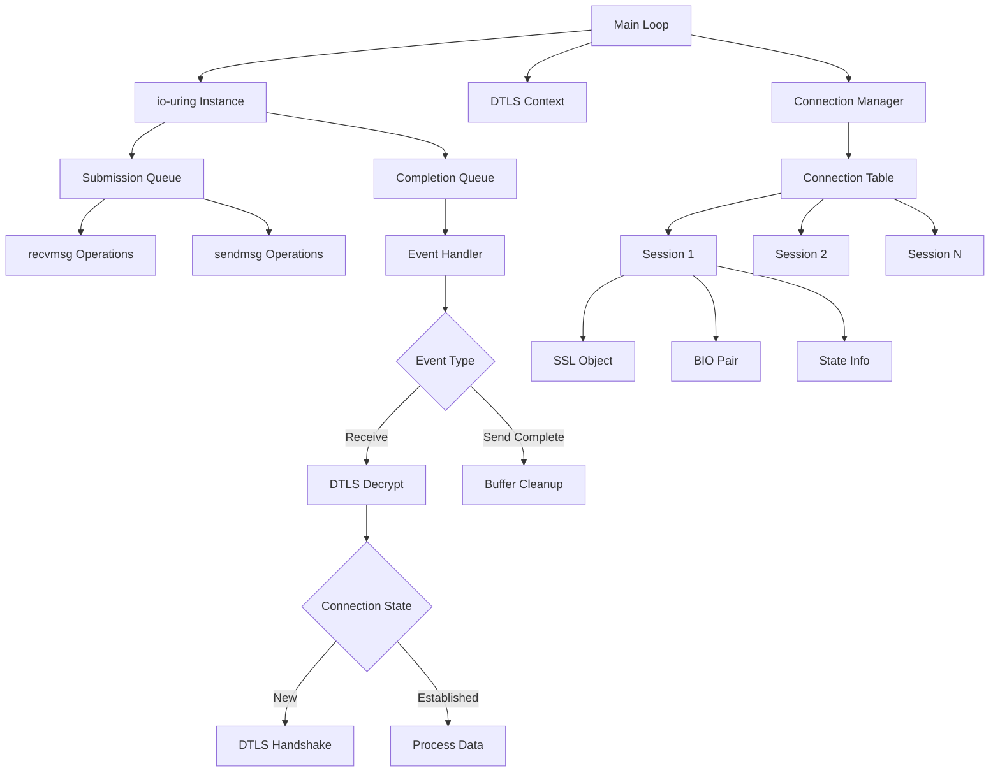

# io-uring + DTLS UDP Transport Architecture

## Overview
High-performance UDP server using io-uring for asynchronous I/O and OpenSSL for DTLS encryption, designed to handle many concurrent connections efficiently.

## System Architecture



## Core Components

### 1. io-uring Manager
- **Purpose**: Manages asynchronous I/O operations
- **Responsibilities**:
  - Initialize io-uring instance with appropriate queue depth
  - Submit UDP receive/send operations
  - Process completion events
  - Handle errors and retries

### 2. UDP Socket Manager
- **Purpose**: Manages UDP socket lifecycle
- **Responsibilities**:
  - Create and configure non-blocking UDP socket
  - Bind to specified address and port
  - Provide socket file descriptor to io-uring

### 3. DTLS Context Manager
- **Purpose**: Manages OpenSSL DTLS configuration
- **Responsibilities**:
  - Initialize OpenSSL library
  - Create DTLS server context
  - Load certificates and private keys
  - Configure cipher suites and security parameters

### 4. Connection State Manager
- **Purpose**: Tracks individual DTLS sessions
- **Responsibilities**:
  - Maintain hash table of active connections (keyed by client address)
  - Create/destroy SSL objects per connection
  - Manage BIO pairs for memory-based I/O
  - Track connection state (handshaking, established, closing)
  - Handle connection timeouts

### 5. Event Loop
- **Purpose**: Main processing loop
- **Responsibilities**:
  - Submit receive operations to io-uring
  - Wait for completion events
  - Dispatch events to appropriate handlers
  - Coordinate between io-uring and DTLS layers

### 6. DTLS Handlers
- **Purpose**: Process DTLS protocol operations
- **Responsibilities**:
  - Handle DTLS handshake messages
  - Decrypt incoming data
  - Encrypt outgoing data
  - Manage retransmissions for handshake

## Data Flow

### Receive Path
1. io-uring completes recvmsg operation with UDP datagram
2. Look up connection by source address
3. If new connection, create SSL object and initiate handshake
4. Feed data into SSL BIO
5. Call SSL_read to decrypt application data
6. Process decrypted data
7. Submit new recvmsg operation

### Send Path
1. Application wants to send data
2. Call SSL_write with plaintext data
3. Read encrypted data from SSL BIO
4. Submit sendmsg operation via io-uring
5. On completion, free buffers

## Key Design Decisions

### Memory Management
- Pre-allocate buffer pool for receive operations
- Use reference counting for shared buffers
- Minimize allocations in hot path

### Connection Tracking
- Hash table with client address as key
- Periodic cleanup of idle connections
- Configurable connection limits

### Error Handling
- Graceful degradation on resource exhaustion
- Proper cleanup on connection errors
- Logging for debugging

### Performance Optimizations
- Batch submission of io-uring operations
- Zero-copy where possible
- Efficient connection lookup (hash table)
- Minimal locking (single-threaded design)

## File Structure

```
dataplane/
├── src/
│   ├── main.c              # Entry point and main loop
│   ├── iouring.c           # io-uring operations
│   ├── udp_socket.c        # UDP socket management
│   ├── dtls_context.c      # DTLS/OpenSSL initialization
│   ├── connection.c        # Connection state management
│   ├── event_handler.c     # Event processing logic
│   └── utils.c             # Helper functions
├── include/
│   ├── iouring.h
│   ├── udp_socket.h
│   ├── dtls_context.h
│   ├── connection.h
│   ├── event_handler.h
│   └── utils.h
├── examples/
│   └── server_example.c    # Example server implementation
├── CMakeLists.txt          # Build configuration
├── README.md               # Documentation
└── ARCHITECTURE.md         # This file
```

## Dependencies

- **liburing**: io-uring library (Linux kernel 5.1+)
- **OpenSSL 1.1.1+**: DTLS 1.2 support
- **Linux kernel 5.1+**: io-uring support

## Build Requirements

- GCC or Clang with C11 support
- CMake 3.10+
- liburing-dev
- libssl-dev

## Configuration Parameters

- Queue depth for io-uring (default: 256)
- Maximum concurrent connections (default: 10000)
- Connection timeout (default: 60 seconds)
- Buffer sizes for receive/send operations
- DTLS cipher suites
- Certificate and key paths

## Future Enhancements

- Multi-threaded support with io-uring sharing
- Connection migration support
- Advanced metrics and monitoring
- Configuration file support
- Graceful reload capability