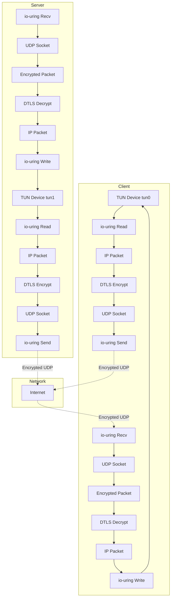

# TUN/DTLS VPN Tunnel Architecture

## Overview
A secure VPN tunnel implementation using TUN devices for packet capture/injection, io-uring for high-performance I/O, and DTLS for encryption. This creates an encrypted tunnel between client and server, routing IP packets through the secure channel.

## System Architecture



## Data Flow

### Client → Server (Outbound)

```
1. Application sends packet to 10.8.0.2
   ↓
2. Kernel routes to TUN device (tun0: 10.8.0.1)
   ↓
3. io-uring reads IP packet from TUN device
   ↓
4. DTLS encrypts the packet
   ↓
5. io-uring sends encrypted UDP packet to server
   ↓
6. Server receives encrypted UDP packet via io-uring
   ↓
7. DTLS decrypts to get original IP packet
   ↓
8. io-uring writes IP packet to server's TUN device (tun1)
   ↓
9. Kernel routes packet to destination (or forwards)
```

### Server → Client (Inbound)

```
1. Packet arrives at server destined for 10.8.0.1
   ↓
2. Kernel routes to TUN device (tun1)
   ↓
3. io-uring reads IP packet from TUN device
   ↓
4. DTLS encrypts the packet
   ↓
5. io-uring sends encrypted UDP packet to client
   ↓
6. Client receives encrypted UDP packet via io-uring
   ↓
7. DTLS decrypts to get original IP packet
   ↓
8. io-uring writes IP packet to client's TUN device (tun0)
   ↓
9. Kernel delivers packet to application
```

## Core Components

### 1. TUN Device Manager
**Purpose**: Create and configure TUN virtual network interfaces

**Responsibilities**:
- Create TUN device (`/dev/net/tun`)
- Configure IP address and netmask
- Set MTU (typically 1400 to account for DTLS overhead)
- Bring interface up
- Configure routing if needed

**Key Operations**:
```c
// Create TUN device
int tun_fd = tun_create("tun0");

// Configure IP address
tun_set_ip(tun_fd, "10.8.0.1", "255.255.255.0");

// Set MTU (IP MTU - DTLS overhead)
tun_set_mtu(tun_fd, 1400);

// Bring up
tun_set_up(tun_fd);
```

### 2. Dual io-uring Instances
**Purpose**: Separate I/O rings for TUN and UDP operations

**Option A: Single Ring** (simpler)
- One io-uring instance handles both TUN and UDP
- Use user_data to distinguish operation types

**Option B: Dual Rings** (better performance)
- One ring for TUN device I/O
- One ring for UDP socket I/O
- Can be polled independently

### 3. Packet Processing Pipeline

**Client Pipeline**:
```
TUN Read → Encrypt → UDP Send
UDP Recv → Decrypt → TUN Write
```

**Server Pipeline**:
```
UDP Recv → Decrypt → TUN Write
TUN Read → Encrypt → UDP Send
```

### 4. Connection Management
**Client**: Single DTLS connection to server
**Server**: Multiple DTLS connections (one per client)

## TUN Device Details

### What is a TUN Device?

A **TUN** (network TUNnel) device is a virtual network interface that:
- Operates at Layer 3 (IP layer)
- Allows userspace programs to read/write IP packets
- Appears as a regular network interface to the kernel

### TUN vs TAP
- **TUN**: Layer 3 (IP packets) - what we're using
- **TAP**: Layer 2 (Ethernet frames) - includes MAC addresses

### Creating a TUN Device

```c
#include <linux/if.h>
#include <linux/if_tun.h>
#include <sys/ioctl.h>
#include <fcntl.h>

int tun_create(const char *dev_name) {
    struct ifreq ifr;
    int fd, err;
    
    // Open TUN/TAP device
    fd = open("/dev/net/tun", O_RDWR);
    if (fd < 0) {
        return -1;
    }
    
    memset(&ifr, 0, sizeof(ifr));
    
    // IFF_TUN: TUN device (IP packets)
    // IFF_NO_PI: No packet information header
    ifr.ifr_flags = IFF_TUN | IFF_NO_PI;
    
    if (dev_name) {
        strncpy(ifr.ifr_name, dev_name, IFNAMSIZ);
    }
    
    // Create device
    err = ioctl(fd, TUNSETIFF, (void *)&ifr);
    if (err < 0) {
        close(fd);
        return -1;
    }
    
    return fd;
}
```

### Configuring TUN Device

```bash
# Create and configure (done by our program)
# But equivalent shell commands:

# Bring up interface
ip link set tun0 up

# Set IP address
ip addr add 10.8.0.1/24 dev tun0

# Set MTU
ip link set tun0 mtu 1400

# Add route (if needed)
ip route add 10.8.0.0/24 dev tun0
```

## MTU Considerations

### MTU Calculation
```
Ethernet MTU:        1500 bytes
- IP header:           20 bytes
- UDP header:           8 bytes
- DTLS overhead:       ~29 bytes (record header + MAC + padding)
= Available for IP:  ~1443 bytes

Safe TUN MTU:        1400 bytes (with margin)
```

### Why MTU Matters
- TUN packets larger than (UDP MTU - DTLS overhead) will be fragmented
- Fragmentation reduces performance
- Set TUN MTU to avoid fragmentation

## Security Considerations

### 1. Packet Validation
```c
// Validate IP packet before processing
bool validate_ip_packet(const uint8_t *packet, size_t len) {
    if (len < 20) return false;  // Minimum IP header
    
    uint8_t version = (packet[0] >> 4);
    if (version != 4 && version != 6) return false;
    
    // Additional checks...
    return true;
}
```

### 2. Routing Security
- Only route specific subnets through tunnel
- Implement firewall rules
- Validate source/destination addresses

### 3. DTLS Security
- Use strong cipher suites
- Implement certificate validation
- Enable perfect forward secrecy

## Implementation Details

### File Structure
```
dataplane/
├── src/
│   ├── tun_device.c        # TUN device management
│   ├── iouring.c           # io-uring operations
│   ├── udp_socket.c        # UDP socket management
│   ├── dtls_context.c      # DTLS initialization
│   ├── connection.c        # Connection state
│   ├── packet_handler.c    # Packet processing
│   ├── client.c            # Client main loop
│   ├── server.c            # Server main loop
│   └── utils.c             # Utilities
├── include/
│   ├── tun_device.h
│   ├── iouring.h
│   ├── udp_socket.h
│   ├── dtls_context.h
│   ├── connection.h
│   ├── packet_handler.h
│   └── utils.h
└── examples/
    ├── vpn_client.c        # VPN client example
    └── vpn_server.c        # VPN server example
```

### Client Main Loop

```c
int main() {
    // 1. Create TUN device
    int tun_fd = tun_create("tun0");
    tun_set_ip(tun_fd, "10.8.0.1", "255.255.255.0");
    tun_set_mtu(tun_fd, 1400);
    tun_set_up(tun_fd);
    
    // 2. Create UDP socket
    int udp_fd = udp_socket_create();
    
    // 3. Initialize io-uring
    struct io_uring ring;
    io_uring_queue_init(256, &ring, 0);
    
    // 4. Initialize DTLS
    SSL_CTX *ssl_ctx = dtls_client_context_init();
    SSL *ssl = SSL_new(ssl_ctx);
    // Setup BIO pair...
    
    // 5. Connect to server (DTLS handshake)
    struct sockaddr_in server_addr = {...};
    dtls_connect(ssl, udp_fd, &server_addr);
    
    // 6. Submit initial operations
    submit_tun_read(&ring, tun_fd);    // Read from TUN
    submit_udp_recv(&ring, udp_fd);    // Receive from UDP
    
    // 7. Main event loop
    while (running) {
        struct io_uring_cqe *cqe;
        io_uring_wait_cqe(&ring, &cqe);
        
        if (cqe->user_data == TUN_READ_OP) {
            // Got packet from TUN
            handle_tun_read(cqe, ssl, udp_fd);
        } else if (cqe->user_data == UDP_RECV_OP) {
            // Got encrypted packet from UDP
            handle_udp_recv(cqe, ssl, tun_fd);
        }
        
        io_uring_cqe_seen(&ring, cqe);
    }
    
    // 8. Cleanup
    close(tun_fd);
    close(udp_fd);
    io_uring_queue_exit(&ring);
    SSL_free(ssl);
    SSL_CTX_free(ssl_ctx);
}
```

### Server Main Loop

```c
int main() {
    // 1. Create TUN device
    int tun_fd = tun_create("tun1");
    tun_set_ip(tun_fd, "10.8.0.254", "255.255.255.0");
    tun_set_mtu(tun_fd, 1400);
    tun_set_up(tun_fd);
    
    // 2. Create UDP socket and bind
    int udp_fd = udp_socket_create();
    udp_socket_bind(udp_fd, 4433);
    
    // 3. Initialize io-uring
    struct io_uring ring;
    io_uring_queue_init(256, &ring, 0);
    
    // 4. Initialize DTLS server context
    SSL_CTX *ssl_ctx = dtls_server_context_init("cert.pem", "key.pem");
    
    // 5. Initialize connection table
    connection_table_t *conn_table = connection_table_init(1024, 10000);
    
    // 6. Submit initial operations
    submit_tun_read(&ring, tun_fd);    // Read from TUN
    submit_udp_recv(&ring, udp_fd);    // Receive from UDP
    
    // 7. Main event loop
    while (running) {
        struct io_uring_cqe *cqe;
        io_uring_wait_cqe(&ring, &cqe);
        
        if (cqe->user_data == TUN_READ_OP) {
            // Got packet from TUN - need to send to client
            handle_tun_read(cqe, conn_table, udp_fd);
        } else if (cqe->user_data == UDP_RECV_OP) {
            // Got encrypted packet from client
            handle_udp_recv(cqe, conn_table, tun_fd, ssl_ctx);
        }
        
        io_uring_cqe_seen(&ring, cqe);
    }
    
    // 8. Cleanup
    close(tun_fd);
    close(udp_fd);
    io_uring_queue_exit(&ring);
    connection_table_cleanup(conn_table);
    SSL_CTX_free(ssl_ctx);
}
```

## Packet Handler Details

### TUN Read Handler (Client)

```c
void handle_tun_read(struct io_uring_cqe *cqe, SSL *ssl, int udp_fd) {
    if (cqe->res <= 0) {
        // Error or EOF
        return;
    }
    
    // Got IP packet from TUN
    uint8_t *ip_packet = get_buffer_from_cqe(cqe);
    int packet_len = cqe->res;
    
    // Validate IP packet
    if (!validate_ip_packet(ip_packet, packet_len)) {
        goto resubmit;
    }
    
    // Encrypt via DTLS
    int written = SSL_write(ssl, ip_packet, packet_len);
    if (written <= 0) {
        // Handle error
        goto resubmit;
    }
    
    // Read encrypted data from wbio
    int pending = BIO_ctrl_pending(ssl->wbio);
    if (pending > 0) {
        uint8_t encrypted[2048];
        int read = BIO_read(ssl->wbio, encrypted, sizeof(encrypted));
        
        // Send encrypted packet via UDP
        submit_udp_send(udp_fd, encrypted, read, &server_addr);
    }
    
resubmit:
    // Submit new TUN read
    submit_tun_read(ring, tun_fd);
}
```

### UDP Receive Handler (Client)

```c
void handle_udp_recv(struct io_uring_cqe *cqe, SSL *ssl, int tun_fd) {
    if (cqe->res <= 0) {
        goto resubmit;
    }
    
    // Got encrypted packet from server
    uint8_t *encrypted = get_buffer_from_cqe(cqe);
    int encrypted_len = cqe->res;
    
    // Write to rbio
    BIO_write(ssl->rbio, encrypted, encrypted_len);
    
    // Decrypt
    uint8_t decrypted[2048];
    int read = SSL_read(ssl, decrypted, sizeof(decrypted));
    
    if (read > 0) {
        // Got decrypted IP packet
        // Write to TUN device
        submit_tun_write(tun_fd, decrypted, read);
    }
    
    // Check if SSL wants to send (handshake messages)
    int pending = BIO_ctrl_pending(ssl->wbio);
    if (pending > 0) {
        uint8_t outgoing[2048];
        int out_len = BIO_read(ssl->wbio, outgoing, sizeof(outgoing));
        submit_udp_send(udp_fd, outgoing, out_len, &server_addr);
    }
    
resubmit:
    // Submit new UDP receive
    submit_udp_recv(ring, udp_fd);
}
```

## Routing Configuration

### Client Routing
```bash
# Route specific subnet through tunnel
ip route add 192.168.100.0/24 dev tun0

# Or route all traffic (full VPN)
ip route add default dev tun0
```

### Server Routing
```bash
# Enable IP forwarding
echo 1 > /proc/sys/net/ipv4/ip_forward

# NAT for outbound traffic
iptables -t nat -A POSTROUTING -s 10.8.0.0/24 -o eth0 -j MASQUERADE

# Allow forwarding
iptables -A FORWARD -i tun1 -j ACCEPT
iptables -A FORWARD -o tun1 -j ACCEPT
```

## Testing

### Setup Test Environment

```bash
# Terminal 1: Start server
sudo ./vpn_server --port 4433 --tun-ip 10.8.0.254/24

# Terminal 2: Start client
sudo ./vpn_client --server 192.168.1.100:4433 --tun-ip 10.8.0.1/24

# Terminal 3: Test connectivity
ping 10.8.0.254  # Ping server through tunnel
```

### Verify Tunnel

```bash
# Check TUN interfaces
ip addr show tun0
ip addr show tun1

# Monitor traffic
tcpdump -i tun0 -n
tcpdump -i udp port 4433  # See encrypted traffic
```

## Performance Optimization

1. **MTU Tuning**: Set optimal MTU to avoid fragmentation
2. **Buffer Sizes**: Match TUN MTU for efficient I/O
3. **Queue Depth**: Balance latency vs throughput
4. **Zero-Copy**: Use io-uring zero-copy features where possible
5. **Batch Operations**: Submit multiple operations together

## Limitations

- Single-threaded design
- No connection migration
- Basic routing (no advanced policy routing)
- IPv4 only (IPv6 can be added)

## Future Enhancements

- Multi-threaded support
- IPv6 support
- Advanced routing policies
- Connection migration
- Compression
- QoS/traffic shaping
- Multiple concurrent tunnels